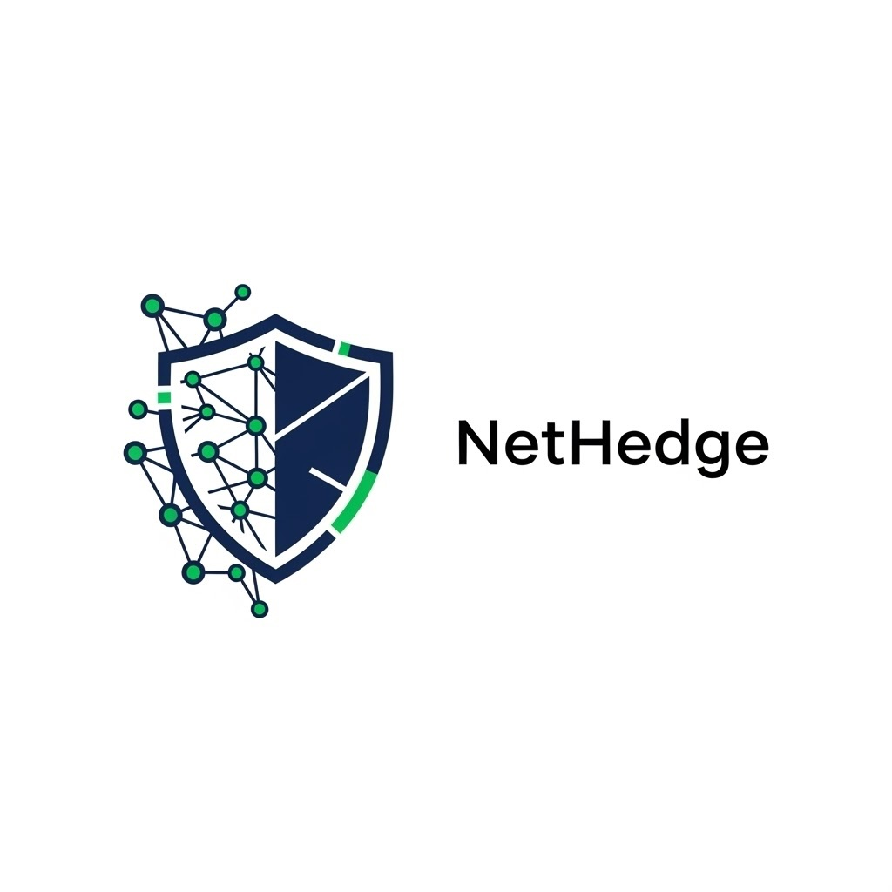
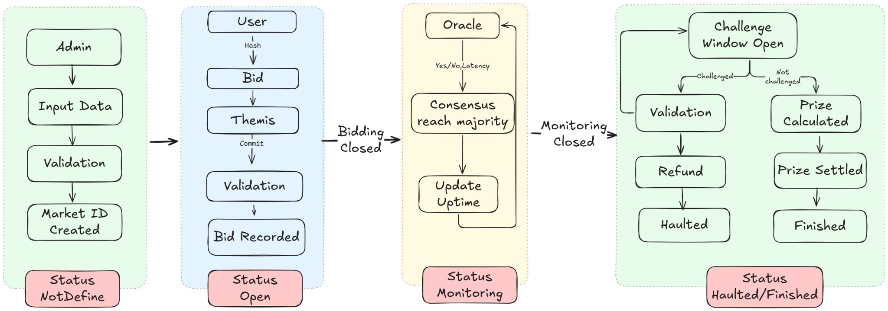
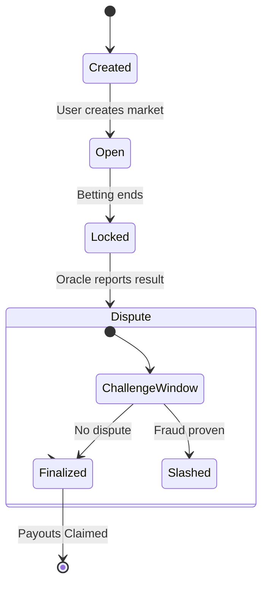
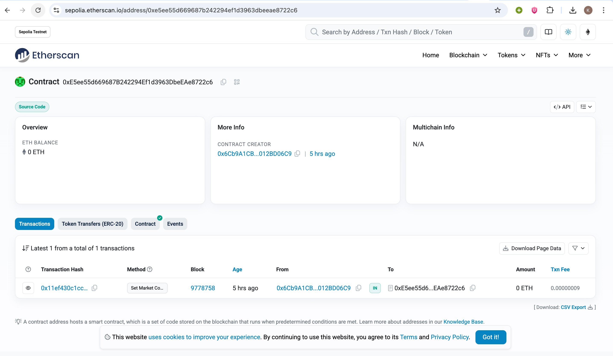

# NetHedge

<p align="center"\>

</p\>

<h4 align="center"\>
Decentralized Uptime Prediction Markets: Hedge against website downtime or speculate on infrastructure reliability with fair, tamper-proof settlement.
</h4\>

<p align="center"\>
Built with 🏗 Scaffold-ETH 2
</p\>

-----

## 1\. The Problem

In the modern digital economy, downtime is expensive.

  * **SaaS Companies** lose revenue and trust when their infrastructure fails.
  * **Traders & Competitors** have no transparent way to speculate on reliability.
  * **Traditional SLAs** are opaque, slow, and often managed by the service provider themselves.

## 2\. Our Solution

**NetHedge** is a blockchain-based prediction market platform that allows users to create binary markets betting on whether a specific website will maintain **≥99% uptime** during a monitoring period.

  * **Permissionless:** Anyone can create a market for any URL (1 min - 30 days monitoring).
  * **Fair Ordering:** Uses **Themis-style** batching and **Hash Commit-Reveal** schemes to prevent front-running and MEV attacks.
  * **Trustless Settlement:** Markets are resolved by a consensus of bonded oracles with a dispute window, ensuring outcomes are determined by reality, not a central admin.

## 3\. System Architecture

NetHedge operates on a three-layer architecture ensuring separation of concerns between the UI, the Blockchain logic, and Off-chain data monitoring.


<p align="center"\>

</p\>

## 4\. Market Lifecycle & State Machine

NetHedge enforces a strict **Monotonic State Machine**. Markets move strictly forward, ensuring that once a market is finalized, funds are distributed deterministically, and history cannot be rewritten.



## 5\. Key Invariants & Guarantees

We designed the protocol around strict mathematical invariants to ensure user safety:

1.  **Solvency (No Orphaned Funds):** `Assets >= Liabilities`. The contract balance always equals the sum of potential payouts plus fees. No funds can ever be lost or locked forever.
2.  **Settlement Idempotence:** Payouts execute exactly **ONCE**. Even if a winner calls the claim function multiple times, they are paid only the first time.
3.  **Strict Temporal Order:** Betting *must* close before Monitoring begins. No retroactive bets are allowed.
4.  **Fail-Safe Atomic Refunds:** If a market is cancelled (due to oracle timeout or liveness failure), users are mathematically guaranteed a 100% refund of their principal.

## 6\. Threat Model & Defenses

| Threat Vector | Defense Mechanism |
| :--- | :--- |
| **MEV / Front-running** | **Fair Ordering Architecture:** We use a Hash Commit-Reveal scheme. Users submit a hash of their vote, which is ordered before the vote is revealed, making it impossible for validators to censor or front-run based on content. |
| **Oracle Manipulation** | **Bonded Consensus:** Reporters must stake value. If they report false uptime (e.g., claiming UP when site is DOWN), they are slashed during the dispute window. |
| **Chain Reorgs** | **State Machine Safety:** Our monotonic state transitions and idempotent payout logic ensure that even if the chain reorganizes, double-spending is impossible. |

## 7\. Live Deployment

### 🚀 Live Demo

You can access the live application here: https://net-hedge-nextjs.vercel.app

### ✅ Verified Contracts

The smart contracts are deployed and verified on the **Sepolia Testnet**.

| Contract | Etherscan Link |
| :--- | :--- |
| **UptimeMarket.sol** | https://sepolia.etherscan.io/address/0x1e15fbd8e40609f95788a166aec4b895bfb2cffe |
| **UptimeOracle.sol** | https://sepolia.etherscan.io/address/0xe5ee55d669687b242294ef1d3963dbeeae8722c6 |

<p align="center"\>

<br>
<em\>Fig: Verified Contract Interaction on Etherscan</em\>
</p\>

## 8\. Tech Stack

  * **Framework:** 🏗 Scaffold-ETH 2
  * **Smart Contracts:** Solidity 0.8.20
  * **Frontend:** Next.js 14, TypeScript, Tailwind CSS
  * **Blockchain Interaction:** Wagmi, Viem, RainbowKit
  * **Testing:** Hardhat (44 test cases, 100% passing)

## 9\. Getting Started

To run NetHedge locally, follow these steps:

1.  **Install dependencies:**

    ```bash
    yarn install
    ```

2.  **Start a local network:**

    ```bash
    yarn chain
    ```

3.  **Deploy the contracts:**

    ```bash
    yarn deploy
    ```

4.  **Start the frontend:**

    ```bash
    yarn start
    ```

Visit `http://localhost:3000` to interact with the decentralized prediction market.

## 10\. Team

  * **Pratyaksh Dhairya Panwar**
  * **Kushagra Gupta**
  * *IIT Delhi*